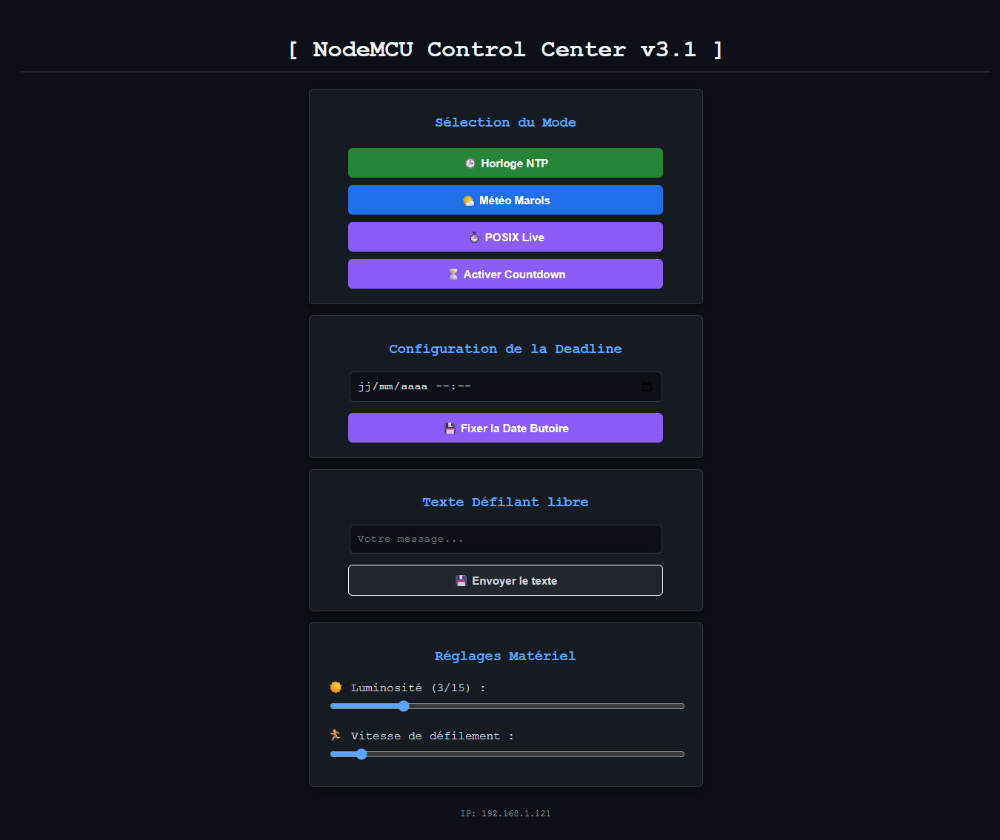
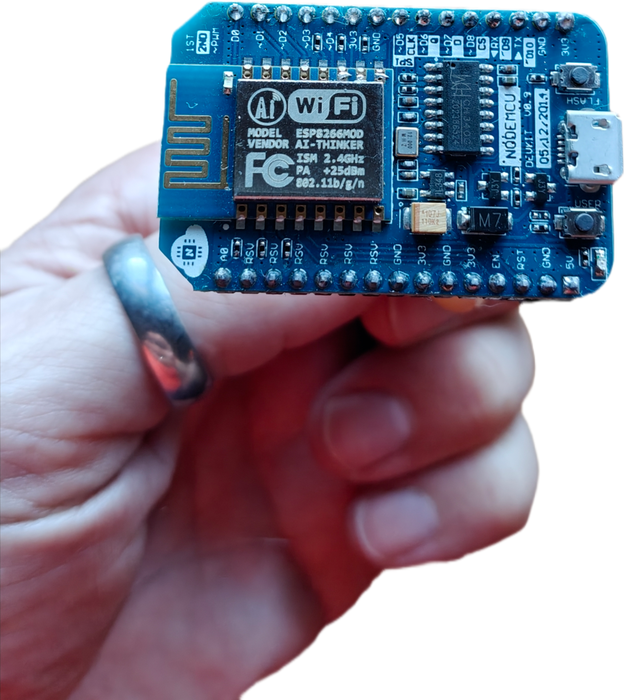
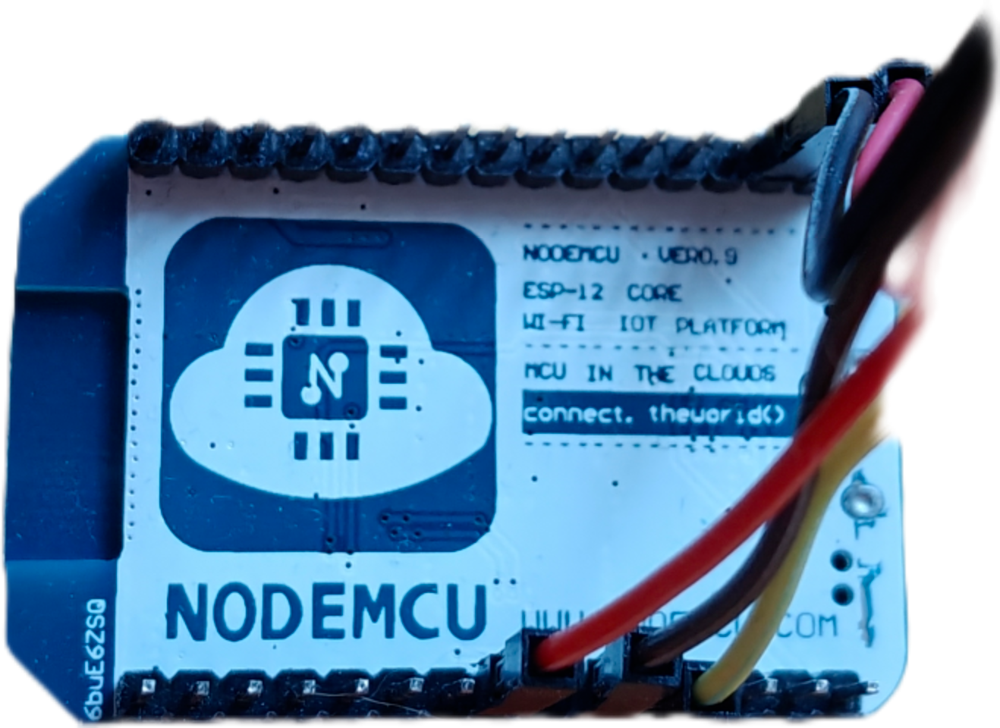

# ESP8266 MAX7219 LED Matrix Display & Control Center

Un système complet d'affichage connecté sur matrice LED 8x8 (MAX7219) piloté par un microcontrôleur ESP8266 (NodeMCU / Wemos D1 Mini).

Le système intègre un serveur Web embarqué proposant une interface moderne sombre (*Dark Mode*) permettant de piloter à distance les modes d'affichage, régler la luminosité, la vitesse et fixer des compteurs à rebours.



---

## 🛠️ Matériel Utilisé

- **Microcontrôleur :** ESP8266 (NodeMCU v1.0 / ESP-12E).
- **Affichage :** Module Matrice de LED 8x8 MAX7219 FC-16 (Chaînage de **7 modules / 56x8 pixels**).
- **Alimentation :** 5V Micro-USB ou alimentation externe 5V dédiée pour les matrices LED.

<div align="center">
  
  
  <p><em>Vue de la carte NodeMCU ESP8266 utilisée (Recto / Verso)</em></p>
</div>

### Câblage (ESP8266 ↔ MAX7219)

| MAX7219 Pin | ESP8266 Pin | Pin Arduino |
| :--- | :--- | :--- |
| **VCC** | 5V / VV | 5V |
| **GND** | GND | GND |
| **DIN** | D7 | GPIO13 (HMOSI) |
| **CS** | D8 | GPIO15 (HCS) |
| **CLK** | D5 | GPIO14 (HSCLK) |

---

## 💻 Logiciel & Bibliothèques

Développé sous l'environnement **Arduino IDE** (avec le support de carte ESP8266).

### Bibliothèques Requises :
- `MD_Parola` & `MD_MAX72XX` (Gestion fine des matrices LED et effets de défilement).
- `ArduinoJson` (v6+) (Parsing des API météo JSON).
- `ESP8266WiFi`, `ESP8266WebServer`, `ESP8266HTTPClient`, `ESP8266mDNS` (Gestion de la pile réseau et du serveur web).
- `EEPROM` & `time.h` (Stockage permanent et synchronisation horaire NTP).

---

## ✨ Fonctionnalités & Modes d'Affichage

Le système propose 5 modes d'affichage commutables instantanément depuis l'interface web :

1. **🕒 Horloge NTP (`MODE_CLOCK`) :**
   - Heure synchronisée via serveurs NTP (`fr.pool.ntp.org`).
   - Gestion automatique de l'heure d'été/hiver (`CET-1CEST`).
   - Affichage complet au format `HH:MM:SS` avec clignotement dynamique des séparateurs.

2. **🌤️ Météo Locale (`MODE_WEATHER`) :**
   - Interrogation automatique de l'API gratuite [Open-Meteo](https://open-meteo.com/).
   - Défilement de la température actuelle, de l'état du ciel et des températures Min/Max prévues.
   - Rafraîchissement automatique toutes les heures.

3. **⏱️ Timestamp POSIX Live (`MODE_POSIX_LIVE`) :**
   - Affichage en temps réel du timestamp Unix (nombre de secondes écoulées depuis le 1er janvier 1970).

4. **⏳ Compte à Rebours / Countdown (`MODE_COUNTDOWN`) :**
   - Affichage dynamique en secondes restantes jusqu'à une date butoire (*Deadline*).
   - Configuration simple via sélecteur de date/heure HTML5 (`datetime-local`).

5. **💬 Message Texte Libre (`MODE_TEXT`) :**
   - Permet d'envoyer n'importe quel message personnalisé depuis l'interface web pour un défilement en boucle.

---

## 🌐 Interface Web de Contrôle

L'interface web embarquée est accessible directement via l'IP fixe attribuée à l'ESP8266 ou via mDNS sur `http://led.local`.

### Ce qu'il est possible de faire depuis la page web :
- **Commutation de mode :** Basculer en un clic entre l'Horloge, la Météo, le POSIX Live ou le Countdown.
- **Définition de la Deadline :** Choisir une date et une heure cible via un calendrier intégré.
- **Envoi de texte :** Saisir un message personnalisé (jusqu'à 64 caractères).
- **Contrôle Matériel dynamique (AJAX) :**
  - **Luminosité :** Curseur ajustable de 0 à 15 (prise en compte immédiate sans rechargement de page).
  - **Vitesse de défilement :** Curseur réglable de 20ms à 150ms.

---

## 💾 Persistance des Données (EEPROM)

Les réglages importants sont enregistrés en mémoire flash non-volatile (EEPROM). En cas de coupure de courant ou de redémarrage, l'appareil conserve :
- Le dernier mode d'affichage sélectionné.
- La date/heure cible du compte à rebours.
- La luminosité et la vitesse de défilement configurées.

---

## ⚙️ Installation & Configuration

1. Récupérez le code du projet.
2. Ouvrez le fichier dans l'Arduino IDE.
3. Adaptez les constantes en haut du fichier :
   ```cpp
   const char* ssid     = "VOTRE_WIFI";
   const char* password = "VOTRE_MOT_DE_PASSE";

   // Coordonnées pour la météo
   const float latitude     = 45.XXX; 
   const float longitude    = 4.XXX;
